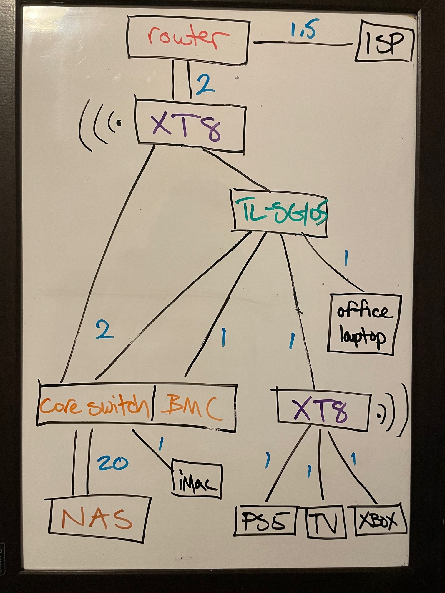
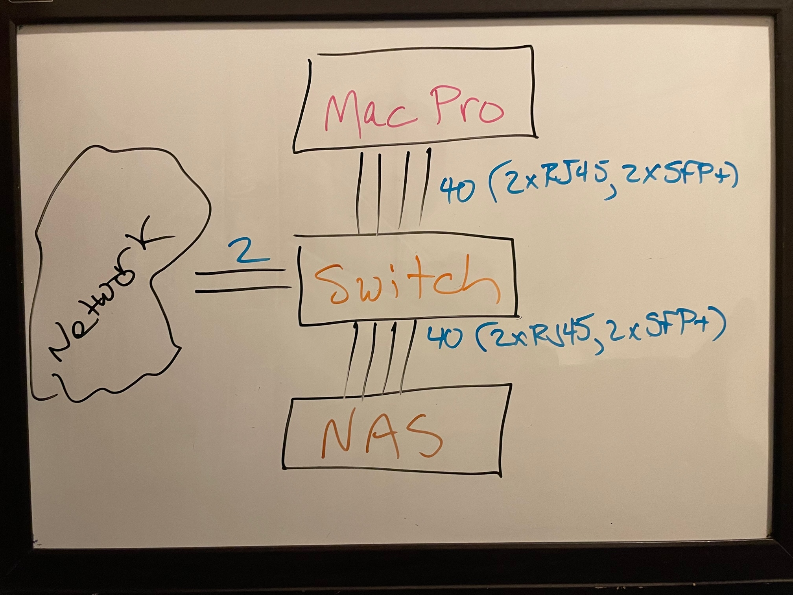

# homelab

A detailed walkthrough of my home lab build. I plan to use this to:
- Set up my own cloud-like infrastructure to play with
- Provide a mechanism to create realtime, failsafe backups
- Perform further quantum computing [research](https://github.com/jasoncolburne/QuantumComputer.jl) through simulation
- Perform further security research
- Begin AI and ML research
- Produce music

## Components
- 2x[Asus ZenWifi AX XT8](https://www.asus.com/ca-en/Networking-IoT-Servers/Whole-Home-Mesh-WiFi-System/ZenWiFi-WiFi-Systems/ASUS-ZenWiFi-AX-XT8/)
- [TP-Link TL-SG105](https://www.tp-link.com/us/home-networking/5-port-switch/tl-sg105/)
- [Hand-Built Multi-Purpose Switch](switch.md)
- [Network Attached Storage](nas.md)
- [StarTech 15U 19" 4-Post Adjustable Depth](https://www.startech.com/en-ca/server-management/4postrack15u)

## Planned components
- ARM-based [Mac Pro](https://www.apple.com/ca/mac-pro/)

## Network Topology

I would have like to connect the `core switch` directly to the primary `XT8`, but it didn't have enough available ports. I could have ran a dual connection to the `core switch` and then hung everything off that, but I wanted more resiliency on the right side of the diagram (if my `core switch` goes down, which is more likely than the TL-SG105, the whole network would become unusable).

The other configuration I considered was the secondary `XT8` node linked to the primary, but the backhaul doesn't support bonding that I know of. I figured that if I wanted to support a dual connection to the `core switch` while providing the resiliency mentioned in the paragraph above, I had the option of switching one connection through the secondary `XT8` or the `TL-SG105`. Since the `XT8` is a far more complex device and I was making my decision based on expected availability, it made sense to arrange things as I have.

I plan to augment the setup eventually, to build the following as a platform for [OpenStack](https://www.openstack.org/):

Since the [Mac Pro](https://www.apple.com/mac-pro/) will likely ship with 2 10Gbe RJ45 ports, I hope to add a dual SFP+ card to enable the above configuration. If it ships with SFP+ ports, I could use all 4 to wire up the Mac and then 4 RJ45 for the NAS. If there are no drivers available for a dual SFP+ card on MacOS, I can use 4xRJ45 and put a dual SFP+ in the NAS (already the plan) and use the 6 RJ45 ports on the switch to achieve essentially the same setup. SFP+ saves power - the primary reason I am hoping to use the technology.
