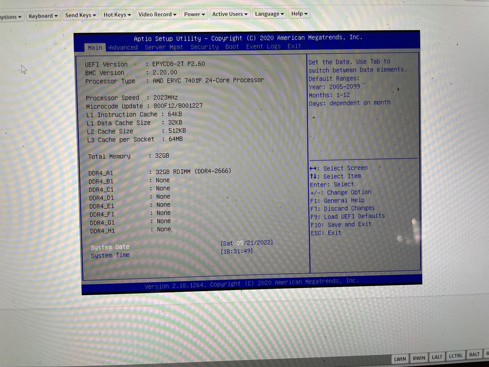
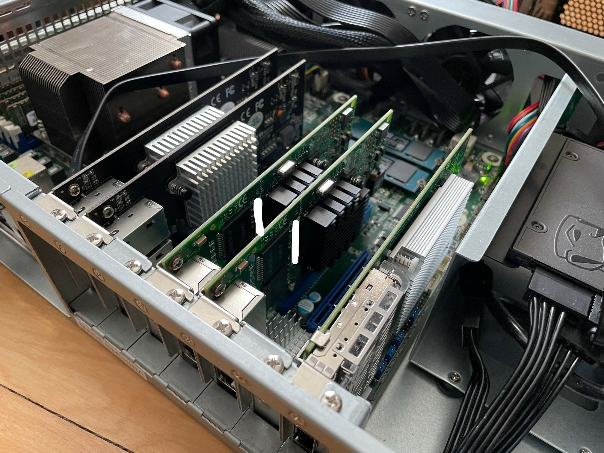

[home](README.md)

# Hand-Built Multi-Purpose Switch

I wanted a way to network a NAS and a workstation for high throughput while providing NAS access to
other devices. To accomplish this, I designed a switch with 10x10gbe ports and 8x1gbe ports. I decided
to go with 6x[RJ45](https://en.wikipedia.org/wiki/Modular_connector#8P8C) and
4x[SFP+](https://en.wikipedia.org/wiki/Small_form-factor_pluggable_transceiver)
for the 10gbe ports, since I was able to procure a 4-port SFP+ card. In total, I required 5 network
cards for 16 ports, leveraging 2 onboard 10gbe ports for the full 18.

For the server itself, I decided to overdo it with the intent of dedicating some resources to
switching while allowing the device to also host VMs/containers in the homelab infrastructure. In particular, I want to be able to compile and simulate quantum circuits.

When I received the motherboard I didn't immediately see the SATA port, and thought the board had only SAS and M.2 connectors. I then decided to purchase the SN570s. As it turns out, there was a SATADOM connector so now I can use that (not powered) to run the 120gb drive for hosting the OS, and the two 500GB drives in mirrored configuration to boost read times. The 500gb drives can be used for caching container/vm images and quantum gates that are hosted on the NAS.

Don't forget to grab an anti-static wrist strap for this build, they are cheaply priced.

## Parts
- 2x[StarTech ST10GPEXNDPI](https://www.startech.com/en-ca/networking-io/st10gpexndpi) (~Intel X550-AT2)
- [10Gtek XL710-10G-4S-X8](https://www.10gtek.com/10gnic) (~Intel X710-DA4)
- 2x[Intel I350-T4V2](https://ark.intel.com/content/www/us/en/ark/products/84805/intel-ethernet-server-adapter-i350t4v2.html)
- ~AMD 7551P~ [AMD 7401P](https://www.amd.com/en/products/cpu/amd-epyc-7401p) (I ordered a 7551P on eBay from a distant seller, received a 7401P, and was swayed by the power savings and hassle of return to keep it. I was refunded the difference in price.)
- [AsRock Rack EPYCD8-2T](http://asrockrack.com/general/productdetail.asp?Model=EPYCD8-2T#Specifications)
- [AsRock Rack TPM2-S Nuvoton NPCT650](https://www.asrockrack.com/general/productdetail.asp?Model=TPM2-S#Specifications)
- ~4x32gb~ 8x32gb Crucial 2666Mhz ECC RDIMM CL19 (~`CT32G4RFD4266`~ <- I originally ordered four of this part number, and received `CT32G4RFD4266.36FB1`, but it turns out the [QVL](https://www.asrockrack.com/general/productdetail.asp?Model=EPYCD8-2T#Memory) for the EPYCD8-2T is even more specific and requires `CT32G4RFD4266.2G6H1.001`. I was sent `CT32G4RFD4266.36FD1` after ordering the QVL part, and this RAM worked.)
- 2x[Western Digital SN570 500GB M.2](https://www.westerndigital.com/en-ca/products/internal-drives/wd-blue-sn570-nvme-ssd#WDS500G3B0C)
- [Kingston A400 120GB 2.5"](https://www.kingston.com/en/ssd/a400-solid-state-drive)
- 3.5" to 2.5" drive tray
- [Dynatron A26](https://www.dynatron.co/product-page/a26)
- PLink 2U Enclosure w/Rails (can be found on eBay)
- [Seasonic 750W Prime-TX](https://seasonic.com/prime-tx)
- IEC 320 90 Degree C13 3 Pin Female to C14 3 Pin Male PDU Adapter (this is a short 10A power cable)
- [Arctic Silver 5](http://www.arcticsilver.com/as5.htm)

## Special Tools

- T20 Torx Head
- Torque Screw Driver capable of measuring 14 in-lbs of torque

## Peak Power Consumption

For power I chose the platinum Seasonic offering boasting 94% efficiency and minimal DC ripple. It's worth noting the enclosure sold by p_link doesn't house a server power supply, but instead a typical ATX PSU. I used the peak numbers from all components and added over 50W for good measure, in case every component peaks at once (this is probably impossible given system constraints). I also chose the Seasonic for the 12 year warranty.

- 26.0W 2x[X550-AT2](https://www.intel.ca/content/www/ca/en/products/docs/network-io/ethernet/network-adapters/ethernet-x550-brief.html)
- 7.4W [X710-DA4](https://www.intel.ca/content/dam/www/public/us/en/documents/product-briefs/ethernet-x710-brief.pdf)
- 10.0W 2x[I350-T4V2](https://www.zayntek.com/product/i350t4v2-intel-ethernet-server-adapter-i350-t4-network-adapter-pcie-2-1-x4-low-profile-gigabit-ethernet)
- 344W [7401P](https://www.servethehome.com/amd-epyc-7401p-linux-benchmarks-and-review-something-special/3/)
- 180W [EPYCD8-T2](https://www.anandtech.com/show/14171/the-asrock-rack-epycd8-2t-motherboard-review/5)
- 110W 8x32gb [RAM](https://www.crucial.com/support/articles-faq-memory/how-much-power-does-memory-use)
- 8.0W 2x[SN570](https://documents.westerndigital.com/content/dam/doc-library/en_us/assets/public/western-digital/product/internal-drives/wd-blue-nvme-ssd/product-brief-wd-blue-sn570-nvme-ssd.pdf)
- 1.535W [A400](https://www.kingston.com/en/ssd/a400-solid-state-drive)
- 7.2W [A26](https://aerocooler.com/dynatron-a26-amd-epyc-sp3-socket-2u-active-cpu-cooler/)

Total: 694 Watts (peak), 56 Watts padding.

## Preparation

1. Equip your wrist strap and ground yourself.

1. Replace brackets on network cards with low-profile variants. Be careful not to damage the delicate ports of the SFP+ card.

1. Mount the A400 in the drive adapter tray.

1. Clean the top surface of the CPU with isopropyl alcohol on a folded paper towel (I used 99%).

1. At this point I considered cleaning the heatsink of the stock paste, but decided to try it and see what the results are like first. It is spread well, so it  may do a better job that I could.

## Assembly

### Rails
1. Install the mounting brackets on your rail guides (I'm just going to make up terms here, go with it).

1. Install the guides on your rack.

1. Install the outer rails in the guides. The instructions indicate one should use screws and nuts, but the nuts were not required in my case.


### Server
1. Start by removing the handles. They are attached with 2 screws each.

1. Next remove the faceplate. Three more screws on the bottom.

1. I chose this point to install the inner rails. (I wanted to try the rails out before loading everything up). Were I to do it again I'd likely wait until the end.

1. Replace the riser slots with low profile slots in the configuration of your choice.

1. Remove the top of the case (4 screws) and install the three required mounting posts for the motherboard (most are already present) and place the plastic insulating mat.

1. With access to the front of the unit thanks to the freshly removed faceplate, install the power supply.

1. It was here that I realized there was not enough room to connect the power cable to the power supply, due to the proximity of the case and the direction of the angled connector. I had to order a 16cm 10A adapter that directs the cable up, where there is more space, rather than to the side.
1. Install the adapter.

1. Remove the 8 screws holding the fan assembly to the forward position of the chassis and push it out of the way so you can install the required power cables. You'll need the ATX power cable, two CPU cables, and a 3 molex connector with a SATA adapter attached to the end. This allows us to power both the fan assembly and A400 with a single cable.

1. Replace the fan assembly in the rear position so there is space for the cables you just attached and connect the molex power cable to the fan control unit. Replace the front panel and handles.

1. If you live in an older home, I recommend testing your outlet now to see if you actually have a grounded circuit or if you simply have GFCI breakers. We'll be relying on the ground, so use an outlet tester to find an outlet that is correctly configured.

1. Connect your server to your outlet by using the rear port, and use the power supply testing cap included with your Seasonic power supply to verify it works correctly. Once you are done, switch the power supply off and remove the testing cap.

1. Ground yourself.

1. Ensuring the power supply is switched off, the power cable is connected, and you are grounded, install the motherboard using the mounting screws provided with the case. Do not over-tighten them and crush the wafer or strip the screws.

1. Connect the front panel to the motherboard using the pinout guide in the motherboard manual.

1. Consult the motherboard manual and verify the position of all jumpers. In my case, the manual indicated the SATADOM port would not be powered by default, but this was not the case and it was shipped in the powered configuration. I moved the jumper to cut power to the port (I believe pin 7), as the A400 will not require this and it has the potential to cause damage.
1. Connect the power cables to the motherboard. Note: You should probably wait to do this until after installing the CPU and RAM. I trusted my power supply's switch not to fail, and I'm not sure if it can fail in a bad way or not.

1. Now you'll want to release the CPU carrier frame with your T20 Torx head driver, in the order specified (In my case this is 3->2->1). Slide your CPU into the carrier and tighten, in the correct order, to 14 in-lbs of torque.

1. Now, you have the option of cleaning the heat sink and using the thermal paste or applying the 
heat sink with the stock paste. I did both, during this process (I removed the heatsink a couple times). You can get an idea of how much paste is required (it's not that much) from the stock paste on the heat sink. Watch some videos online to see how to do this. Tighten the heat sink in a diagonal, alternating, pattern - as if you are replacing a wheel on a car. Though there are 6 pins on the motherboard for the fan power connector, you can easily connect the 4-pin A26 and there is even a plastic guide on the board that should help you orient the pins. Basically, the black wire sits near the edge of the board.

1. Install your RAM. The motherboard manual explains how to install different numbers of modules and how to ensure dual channel activation.

1. Finally, we are ready to test a minimum system configuration. Make sure nothing is touching your soon to be powered components, and turn on the power supply. You should see a couple LEDS come to life. The one near the front panel connectors is the power availability indicator, it should always be on if the PSU is on and the cables are connected. The one near the PCI slots is the BMC heartbeat controller. It will start pulsing when the BMC (board management controller) boots up. You can connect to the BMC via a web UI on the IPMI port, where you can control the board and launch a virtual KVM to interact with the host once it POSTs. Check it out.

1. Once you are ready, use the BMC UI or the physical power button on the faceplate to power the motherboard.

1. You may be wondering what the last photo is all about. This is Dr. Debug, an onboard diagnostic unit that displays hex codes during the POST process. There is a breakdown of what might be wrong in section 2.8 of the motherboard manual. In this case, it is indicating my RAM is not recognized. There is another note in the manual that says some RAM sticks configured with 16 1 gb modules won't work correctly in this motherboard. I speculate this is the difference (though my searches did not yield confirmation) between the first set of ram I purchased and the second set. The first set has 36 modules per stick - at 32gb, with 1 ECC parity bit per 8 data bits (I assume this is how it works), this means each module is 1gb. I will be able to visually inspect when I receive the second set.

1. The second set of RAM I received was nearly identical to the first by model number - though I had ordered a very specific part I received `CT32G4RFD4266.36FD1`. The configuration of the modules appeared the same as before, so I was fairly certain this RAM would not work. I installed a single stick, and luckily, I was incorrect! The system POSTed and the new RAM worked fine!

1. I next installed the remaining RAM and did a quick test to ensure we could POST and it was detected. I could have run [Memtest86](https://en.wikipedia.org/wiki/Memtest86) here, and would recommend you do so, but I was pretty excited to have a working machine so I kept building.


1. With the system booting, it's time to start installing the remaining devices. First, we'll focus on the hard drives and ensure they are detected properly. The A400 was a bit of a pain to install and required removing the mounting bracket, but the NVMe drives were painless.


1. Next up, and finally, are the network cards. Plug them in in your desired configuration. I had to reorganize things to avoid the heatsink with the SFP+ card.


1. Congratulations! If all was successful, your server should POST and you can use the BMC's KVM to load a bootable image. Check out the configuration section for further setup instructions.

## Configuration

I chose to install Debian Bullseye for my host operating system on this server. I have used Gentoo, Debian, Ubuntu, Redhat, CentOS, OpenBSD, slackware and some others that escape me, and I appreciate Debian's simplicity of configuration, availability of documentation, and availability of binary packages.

### BIOS

Now that we can access the BIOS, let's ensure that SVM and SMEE are enabled and IOMMU is set to Auto.


One other annoying thing about the Startech cards is that the onboard ROM tries to do a network PXE boot for each nic, sequentially. This adds quite a bit of time to the boot process. To disable, navigate to the Boot/CSM menu and disable all the OpROMs. I left the M.2 ones on in this photo, but they shouldn't be necessary.


### OS Installation

Use the BMC KVM to load your OS installer. Set up the OS as per usual (make sure you disallow root login and create a user account).

Ensure all your network cards are detected. I believe the final NIC is the BMC, and we don't want our host controlling that so it's okay that it isn't detected and configured by our OS.


Configure the filesystem as you like. Here is what I did:


I left the `/boot` partition in the clear, and encrypted everything else. I used passphrases to create the encrypted partitions (there seems to be a problem formatting the encrypted devices with anything but `ext2` if you choose `random key`), and this means that at first I'll need to enter them through the KVM every time the system boots. I plan to perform the derivation process manually to grab the keys used for encryption, encrypt them with the TPM on the motherboard, and manage the keys during the boot process. I hope to also be able to use the TPM to verify the integrity of the boot partition before handing control to the boot loader. To do this securely, I'll need to disallow custom booting in grub (configure it such that only a single kernel boots with fixed parameters). I should be able to automate loading the OS this way.

This way, in the worst case I can derive the keys again.

I selected minimal packages:


### Convenience

It's nice to not have to constantly type your password when you are setting up a server. This is your choice, I find it helpful. You can remove it after configuration is complete, if you are worried.

```sh
sudo visudo
```

Add the following line (substituting your username):
```
username     ALL=(ALL) NOPASSWD:ALL
```

For convenience, I rolled this process up into some [scripts](src/core-switch/scripts) so I could easily try out different deployment configurations. Here's what I need to do to get my system up and running, after setting up the operating system, which was the most painful part of the iterative process.

```
# in KVM
sudo visudo # update to nopasswd

# from local
scp install.tgz username@remote_host:.

# in KVM
tar xzvf install.tgz
~/install/scripts/provision.sh
git clone --depth=1 https://github.com/romkatv/powerlevel10k.git ~/powerlevel10k
echo 'source ~/powerlevel10k/powerlevel10k.zsh-theme' >> ~/.zshrc
sudo reboot

# from ssh session, after configuring powerlevel10k
~/install/scripts/deploy-openstack-yoga.sh
```

You can deconstruct the scripts and see what I did - I am aware I could have plucked all the files into a single tar file and extracted them together from `/`. That wasn't how it evolved, and here we are. I may make some .deb files in the future to do all this.

### NVMe Instability

This needs to go first, since it could cause problems at any time. After about a week of uptime, the software raid array fell over due to failures with the NVMe drives and APST.

This problem can be eliminated by adding `nvme_core.default_ps_max_latency_us=0` to your grub command line to disable APST.

Edit: Unfortunately the problems persisted:

```
[ 1751.036859] {1}[Hardware Error]: Hardware error from APEI Generic Hardware Error Source: 4
[ 1751.036929] {1}[Hardware Error]: event severity: info
[ 1751.036963] {1}[Hardware Error]:  Error 0, type: fatal
[ 1751.036994] {1}[Hardware Error]:  fru_text: PcieError
[ 1751.037026] {1}[Hardware Error]:   section_type: PCIe error
[ 1751.037078] {1}[Hardware Error]:   port_type: 4, root port
[ 1751.037133] {1}[Hardware Error]:   version: 0.2
[ 1751.037181] {1}[Hardware Error]:   command: 0x0407, status: 0x0010
[ 1751.037242] {1}[Hardware Error]:   device_id: 0000:40:01.3
[ 1751.037296] {1}[Hardware Error]:   slot: 34
[ 1751.037339] {1}[Hardware Error]:   secondary_bus: 0x42
[ 1751.037390] {1}[Hardware Error]:   vendor_id: 0x1022, device_id: 0x1453
[ 1751.037455] {1}[Hardware Error]:   class_code: 060400
[ 1751.037504] {1}[Hardware Error]:   bridge: secondary_status: 0x2000, control: 0x0012
[ 1751.037577] {1}[Hardware Error]:   aer_uncor_status: 0x00000000, aer_uncor_mask: 0x04500000
[ 1751.037656] {1}[Hardware Error]:   aer_uncor_severity: 0x004e2030
[ 1751.037717] {1}[Hardware Error]:   TLP Header: 00000000 00000000 00000000 00000000
[ 1751.040164] pcieport 0000:40:01.3: AER: aer_status: 0x00000000, aer_mask: 0x04500000
[ 1751.040242] pcieport 0000:40:01.3: AER: aer_layer=Transaction Layer, aer_agent=Receiver ID
[ 1751.040295] pcieport 0000:40:01.3: AER: aer_uncor_severity: 0x004e2030
[ 1751.040340] nvme nvme1: frozen state error detected, reset controller
[ 1752.124836] pcieport 0000:40:01.3: AER: Root Port link has been reset
[ 1752.124951] pcieport 0000:40:01.3: AER: device recovery successful
```

Though the device recovered, the fact that it was encrypted raid made it less than usable:

```
❯ sudo umount /var
umount: /var: target is busy.
```

I am now trying the setting `pcie_aspm=off` in addition to the other kernel flag.

### Networking Setup

I made some changes to the basic networking config in `/etc/default/networking`:

```
...

# Set to 'yes' to enable additional verbosity
VERBOSE=yes

...

# Timeout in seconds for waiting for the network to come online.
WAIT_ONLINE_TIMEOUT=30

...
```

And here is how I configured the switch in `/etc/network/interfaces`:

```
# This file describes the network interfaces available on your system
# and how to activate them. For more information, see interfaces(5).

source /etc/network/interfaces.d/*

# The loopback network interface
auto lo
iface lo inet loopback

########################
# CPU Side I350 (1Gbe)
########################

allow-hotplug enp98s0f0
iface enp98s0f0 inet manual
  pre-up   ifconfig $IFACE up
  pre-down ifconfig $IFACE down

allow-hotplug enp98s0f1
iface enp98s0f1 inet manual
  pre-up   ifconfig $IFACE up
  pre-down ifconfig $IFACE down

allow-hotplug enp98s0f2
iface enp97s0f2 inet manual
  pre-up   ifconfig $IFACE up
  pre-down ifconfig $IFACE down

allow-hotplug enp98s0f3
iface enp98s0f3 inet manual
  pre-up   ifconfig $IFACE up
  pre-down ifconfig $IFACE down

########################
# HD Side I350 (1Gbe)
########################

allow-hotplug enp34s0f0
iface enp34s0f0 inet manual
  pre-up   ifconfig $IFACE up
  pre-down ifconfig $IFACE down

allow-hotplug enp34s0f1
iface enp34s0f1 inet manual
  pre-up   ifconfig $IFACE up
  pre-down ifconfig $IFACE down

allow-hotplug enp34s0f2
iface enp34s0f2 inet manual
  pre-up   ifconfig $IFACE up
  pre-down ifconfig $IFACE down

allow-hotplug enp34s0f3
iface enp34s0f3 inet manual
  pre-up   ifconfig $IFACE up
  pre-down ifconfig $IFACE down

########################
# CPU Side X550T (10Gbe)
########################

allow-hotplug enp33s0f0
iface enp33s0f0 inet manual
  pre-up   ifconfig $IFACE up
  pre-down ifconfig $IFACE down

allow-hotplug enp33s0f1
iface enp33s0f1 inet manual
  pre-up   ifconfig $IFACE up
  pre-down ifconfig $IFACE down

########################
# HD Side X550T (10Gbe)
########################

allow-hotplug enp1s0f0
iface enp1s0f0 inet manual
  pre-up   ifconfig $IFACE up
  pre-down ifconfig $IFACE down

allow-hotplug enp1s0f1
iface enp1s0f1 inet manual
  pre-up   ifconfig $IFACE up
  pre-down ifconfig $IFACE down

########################
# Onboard X550T (10Gbe)
########################

allow-hotplug enp99s0f0
iface enp99s0f0 inet manual
  pre-up   ifconfig $IFACE up
  pre-down ifconfig $IFACE down

allow-hotplug enp99s0f1
iface enp99s0f1 inet manual
  pre-up   ifconfig $IFACE up
  pre-down ifconfig $IFACE down

########################
# X710 (10Gbe SFP+)
########################

allow-hotplug enp97s0f0
iface enp97s0f0 inet manual
  pre-up   ifconfig $IFACE up
  pre-down ifconfig $IFACE down

allow-hotplug enp97s0f1
iface enp97s0f1 inet manual
  pre-up   ifconfig $IFACE up
  pre-down ifconfig $IFACE down

allow-hotplug enp97s0f2
iface enp97s0f2 inet manual
  pre-up   ifconfig $IFACE up
  pre-down ifconfig $IFACE down

allow-hotplug enp97s0f3
iface enp97s0f3 inet manual
  pre-up   ifconfig $IFACE up
  pre-down ifconfig $IFACE down

######################
# Bridge
######################

auto br0
iface br0 inet static
  bridge_ports enp1s0f0 enp1s0f1 enp33s0f0 enp33s0f1 enp34s0f0 enp34s0f1 enp34s0f2 enp34s0f3 enp97s0f0 enp97s0f1 enp97s0f2 enp97s0f3 enp98s0f0 enp98s0f1 enp98s0f2 enp98s0f3 enp99s0f0 enp99s0f1 veth0-peer
  address 192.168.1.250
  netmask 255.255.255.0
  pre-up ip link add veth0 type veth peer name veth0-peer && ifconfig veth0 hw ether 01:01:01:01:01:01
  up /usr/sbin/brctl stp br0 on
  post-up sysctl -w net.ipv6.conf.all.disable_ipv6=1 && sysctl -w net.ipv6.conf.default.disable_ipv6=1
  post-down ip link delete veth0

######################
# Primary Interface
######################

auto veth0
iface veth0 inet dhcp
```

The most important bits are the pre-up and post-down hooks in the bridge, they are responsible for creating the [veth](https://man7.org/linux/man-pages/man4/veth.4.html) pair that allows the host to access the network through the switch. Change the MAC address of the veth device to something a bit more sensible than `01:01:01:01:01:01`. I simply used the first random MAC the OS assigned, and fixed it to that so that my DHCP server can assign a static IP to the host.

After configuring the network, plug a cable in to any port, and restart networking:
```sh
sudo systemctl restart networking
```

I also configured sshd to disallow password login, as I can use the BMC if I need. I [set up public key access](https://www.digitalocean.com/community/tutorials/how-to-configure-ssh-key-based-authentication-on-a-linux-server) before I did this. I used an existing key but you can [generate a key pair](https://docs.github.com/en/authentication/connecting-to-github-with-ssh/generating-a-new-ssh-key-and-adding-it-to-the-ssh-agent) if you need to.

Generating new keys (this step happens on your local machine, not the KVM):
```sh
[[ -f ~/.ssh/id_ed25519.pub ]] || ssh-keygen -t ed25519 -C "your_email@example.com"
```

Copying your public key to the server (again, on your local machine):
```sh
cat ~/.ssh/id_ed25519.pub | ssh username@remote_host "mkdir -p ~/.ssh && cat >> ~/.ssh/authorized_keys"
```

Now we can stop using the KVM. SSH in to your server and ensure public key authentication is working correctly (from your local machine):
```sh
ssh username@remote_host
```

Finally, we can edit the `sshd` config and disable password based login.

`/etc/ssh/sshd_config`
```
...
PasswordAuthentication no
...
```

Reboot or restart your ssh daemon after doing this.

#### Firmware

I noticed while examining `dmesg` that the stock SEV firmware (build 1) was loading. During boot, the system was unable to find AMD firmware as requested. I grabbed it from two places, [linux-firmware](https://git.kernel.org/pub/scm/linux/kernel/git/firmware/linux-firmware.git) and the AMD [developer SEV page](https://developer.amd.com/sev/) in the Links and Downloads section (`amd_sev_fam17h_model01h_xxxxx.zip`).

After fully acknowledging any potential implications, drop the appropriate files in `/lib/firmware/amd/`.

Next, run this command to update things:
```sh
sudo update-initramfs -c -k all
```

Upon reboot, you should see this pleasing message:
```
[    8.488939] ccp 0000:04:00.2: firmware: direct-loading firmware amd/amd_sev_fam17h_model01h.sbin
[    8.492186] ccp 0000:04:00.2: SEV firmware update successful
```

and something like (anything but build:1):

```
[    8.592787] ccp 0000:04:00.2: SEV API:0.17 build:48
```

### AMD SEV Setup

[AMD SEV](https://developer.amd.com/sev/) is a cool feature for virtualization. From what I can tell, it prevents a VM from reading memory and registers that weren't wiped by another VM. SME will also protect against physical/ram freezing attacks. I found out about it after I built the server, and being a security buff I decided to try it out immediately.

Using [this guide](https://docs.ovh.com/ca/en/dedicated/enable-and-use-amd-sme-sev/) I was able to get it up and running. Here is how I did it.

I started by grabbing [sev-tool](https://github.com/AMDESE/sev-tool). I used this to verify things seemed normal, did a factory reset, uploaded a custom OCA, and exported my cert chain for use by guest VMs.

Next, I needed to enable some kernel parameters in `/etc/default/grub`:
```
...
GRUB_CMDLINE_LINUX_DEFAULT="mem_encrypt=on kvm_amd.sev=1"
...
```

As you can see, I also removed the `quiet` parameter. Next, I ran:

```sh
sudo update-grub
```

Upon reboot, however, I tried to [grep](https://en.wikipedia.org/wiki/Grep) (I prefer [ripgrep](https://blog.burntsushi.net/ripgrep/)) for the indicators that things were okay in syslog/dmesg, and found that SME was not enabled.

```sh
sudo dmesg | rg SEV
```
This output `SEV supported`.

```sh
sudo dmesg | rg SME
```
This, on the other hand, output nothing.

I then used [this guide](https://randomsecurity.dev/posts/secure-memory-encryption/) and the [debian documentation](https://kernel-team.pages.debian.net/kernel-handbook/ch-common-tasks.html) to build a kernel module to check whether SME was functional, and found it wasn't. After building the kernel module, I realized the symbols for setting encrypted and decrypted memory were not present in the kernel. It turns out that due to some incompatibility issues, this feature was disabled in the default debian kernel at the time of this writing. To enable it, we merely need to update the kernel config (`CONFIG_AMD_MEM_ENCRYPT=y`) and re-build it.

First, run these commands:
```sh
sudo apt install build-essential fakeroot
sudo apt build-dep linux
mkdir -p ~/kernel
cd ~/kernel
apt source linux
cd linux-VERSION
echo "CONFIG_AMD_MEM_ENCRYPT=y" > debian/config/amd64/config.sme
```

Edit `debian/config/amd64/none/defines`:
```
[base]
flavours:
 amd64
 cloud-amd64
 sme-amd64
default-flavour: sme-amd64

[cloud-amd64_image]
configs:
 config.cloud
 amd64/config.cloud-amd64

[sme-amd64_image]
configs:
 amd64/config.sme

[sme-amd64_build]
signed-code: false
```

Edit `debian/config/amd64/defines`:
```
...

[sme-amd64_description]
hardware: 64-bit sme servers
hardware-long: AMD EPYC servers capable of SME
```

Now, regenerate your `Makefile`:
```sh
debian/bin/gencontrol.py
```

Finally, build the kernel:
```sh
fakeroot make -f debian/rules.gen binary-arch_amd64_none_sme-amd64 -j$(nproc)
```

After this finishes, install the kernel and its headers so we can try out that module that tests SME.
```sh
cd ..
sudo apt install \
  linux-image-sme-amd64_5.10.113-1_amd64.deb \
  linux-image-5.10.0-14-sme-amd64_5.10.113-1_amd64.deb \
  linux-headers-sme-amd64_5.10.113-1_amd64.deb \
  linux-headers-5.10.0-14-sme-amd64_5.10.113-1_amd64.deb
```

Reboot to launch your new kernel.
```sh
sudo reboot
```

After a reboot, try this again:
```sh
sudo dmesg | rg SME
```

This time, you should see something like `AMD Memory Encryption Features active: SME`.

Now, we can try launching a virtual machine.
```sh
sudo apt install \
  libvirt-daemon-system \
  virtinst \
  qemu-utils \
  cloud-image-utils
mkdir -p ~/sev-test
cd ~/sev-test
wget https://cloud-images.ubuntu.com/focal/current/focal-server-cloudimg-amd64.img
sudo qemu-img convert focal-server-cloudimg-amd64.img /var/lib/libvirt/images/sev-guest.img
cat >cloud-config <<EOF
#cloud-config

password: terrible-password
chpasswd: { expire: False }
ssh_pwauth: False
EOF
sudo cloud-localds /var/lib/libvirt/images/sev-guest-cloud-config.iso cloud-config
```

We must next tweak the permissions to add `rw` access for `/dev/sev` (as of the time of this writing) in `/etc/apparmor.d/abstractions/libvirt-qemu`:
```
...
  /dev/ptmx rw,
  /dev/sev rw,
  @{PROC}/*/status r,
...
```

Finally, we can launch our VM:
```sh
sudo virsh net-start default
sudo virt-install \
              --name sev-guest \
              --memory 4096 \
              --memtune hard_limit=4563402 \
              --boot uefi \
              --disk /var/lib/libvirt/images/sev-guest.img,device=disk,bus=scsi \
              --disk /var/lib/libvirt/images/sev-guest-cloud-config.iso,device=cdrom \
              --os-type linux \
              --os-variant ubuntu20.04 \
              --import \
              --controller type=scsi,model=virtio-scsi,driver.iommu=on \
              --controller type=virtio-serial,driver.iommu=on \
              --network network=default,model=virtio,driver.iommu=on \
              --memballoon driver.iommu=on \
              --graphics none \
              --launchSecurity sev
```

Inside the VM, we can check that SEV is enabled:
```sh
dmesg | grep SEV
```
Should output `[    0.179686] AMD Secure Encrypted Virtualization (SEV) active`.

To exit your VM, just run the command `sudo poweroff`.

### Secure, Password-less Boot

As I began investigating [this guide](https://fit-pc.com/wiki/index.php?title=Linux:_Full_Disk_Encryption&mobileaction=toggle_view_mobile) I realized my motherboard did not come with an embedded TPM, but instead one can optionally be added. When it arrives, I'll document how I set this up.

### Sanity check

At some point I ran some tests using `sysbench`, and tried out my Quantum Computer simulator, attempting to build a complex 15-[qubit](https://en.wikipedia.org/wiki/Qubit) circuit. Each gate in such a circuit is ~16gb when using 64 bit precision. Shortly after I took this photo, the simulator blew up due to a lack of memory. I plan to refactor the way in which the circuit is built, and type the simulator to allow 32 bit precision as an option.


